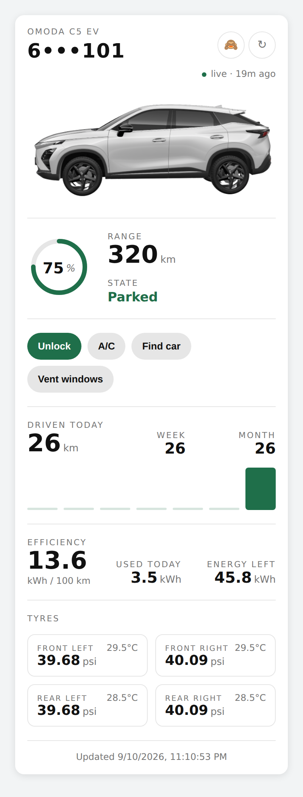
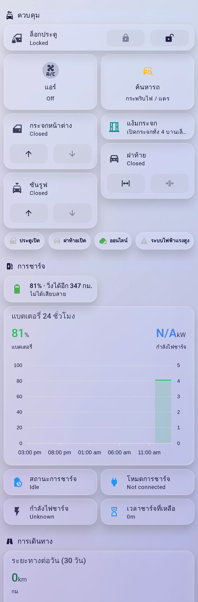

# CarLinko for Home Assistant

[](https://github.com/thititongumpun/ha-carlinko/releases)
[](https://hacs.xyz)


Home Assistant integration for **Omoda, Jaecoo and Chery EVs** that use the **CarLinko** app
(Thailand, Malaysia, Indonesia, Uzbekistan, UAE, South Africa, Vietnam …). Logs in with your CarLinko
account, polls the car over the same cloud API the app uses, and exposes it as normal Home Assistant
entities plus a ready-made Lovelace card. Developed on an **Omoda C5 EV** (Thailand).

<p align="center">
  
  
</p>

## Features

- **Telemetry** every 60 s: battery %, range, odometer, speed, 12 V battery, consumption, WLTC range
- **Charging**: status, AC/DC mode, power, time remaining, plugged-in and charging flags
- **Tyres**: pressure and temperature for all four corners, decoded from the telemetry blob
- **Body**: door lock state, doors, tailgate, windows, sunroof, A/C, high-voltage (car on) state, cloud online
- **Controls**: lock / unlock, A/C on / off, windows open / close / vent, tailgate, sunroof, find car, stop charging
- **Location**: GPS device tracker every 15 min, with a street address (OpenStreetMap fallback when CarLinko has none)
- **Vehicle image**: the CDN render of your exact car, as an `image` entity
- **Service reminder**: last service odometer / date + intervals on the device page → km and days until service, overdue state
- **Lovelace card** `custom:carlinko-card` (car image, battery ring, range, state, quick actions, driven today / week / month, efficiency, tyre grid), plus a full Thai dashboard example
- **English and Thai** translations for the setup flow, every entity, and enum states
- Token persisted across restarts (CarLinko allows one session per account), automatic re-login, re-auth flow
- No extra Python dependencies

## Installation

### HACS (recommended)
1. HACS → Integrations → ⋮ → **Custom repositories** → add `https://github.com/thititongumpun/ha-carlinko` as *Integration*
2. Install **CarLinko**, restart Home Assistant

### Manual
Copy `custom_components/carlinko` into `config/custom_components/` and restart.

## Configuration

Settings → Devices & services → **Add integration** → *CarLinko*:

| Field | Value |
|---|---|
| Account | e-mail or phone registered in the CarLinko app |
| Password | your CarLinko password |
| Region | `sea` for Thailand / Malaysia / Indonesia (default); `ap`, `emea`, `me`, `naf`, `saf`, `sam`, `uzb`, `vn` |

Each vehicle on the account becomes a device named after its licence plate.

## Lovelace card

Add the resource once: Settings → Dashboards → ⋮ → Resources → `/carlinko/carlinko-card.js?v=0.0.11`, type **JavaScript module**. Then:

```yaml
type: custom:carlinko-card
battery_kwh: 61      # usable pack size, for "energy left"
mask_plate: true     # show the plate as B •••• PGB
```

Options, a sections-view example and a full Thai dashboard (Mushroom + ApexCharts) are in
[docs/card.md](docs/card.md) and [docs/dashboard-th.yaml](docs/dashboard-th.yaml).

## Entities

| Platform | Entities |
|---|---|
| Sensor | battery, range, odometer, speed, 12 V battery voltage, energy consumption, rated range (WLTC), charging power, charging time remaining, charging status, charging mode, A/C target temperature, distance until service, days until service, next service, tyre pressure ×4, tyre temperature ×4 |
| Binary sensor | charging, cable connected, door open, tailgate open, air conditioning, high-voltage system (car on), online |
| Lock | door lock |
| Switch | air conditioning |
| Cover | windows, tailgate, sunroof (open / close / tilt) |
| Button | find car, vent windows, stop charging |
| Device tracker | location (+ `address` attribute) |
| Image | vehicle image |
| Number (config) | last service odometer, service interval km, service interval days |
| Date (config) | last service date |

## Service reminder

Dealers rarely log visits into CarLinko, so the integration tracks them itself. On the car's device page
set **Last service odometer** and **Last service date** after each visit. Intervals default to
20,000 km / 365 days and are editable per car. The sensors update immediately, no reload.

Example automation, a month ahead and again when overdue (replace `CAR` with your entity prefix):

```yaml
alias: Car service reminder
triggers:
  - trigger: numeric_state
    entity_id: sensor.CAR_distance_until_service
    below: 1000
  - trigger: numeric_state
    entity_id: sensor.CAR_days_until_service
    below: 30
  - trigger: state
    entity_id: sensor.CAR_next_service
    to: overdue
actions:
  - action: notify.mobile_app_YOUR_PHONE
    data:
      title: Car service due
      message: "{{ states('sensor.CAR_distance_until_service') }} km / {{ states('sensor.CAR_days_until_service') }} days left"
```

## Tyres

Pressure and temperature for all four corners come out of the same telemetry blob as everything
else — no extra request. Both scalings were confirmed against the CarLinko app on an Omoda C5 EV:

| Field | Bytes | Scaling |
|---|---|---|
| Pressure | 44–47 | `kPa = raw × 1.375` |
| Temperature | 48–51 | `°C = raw × 0.5 − 25` |

Order is front-left, front-right, rear-left, rear-right. `0x00` and `0xFF` mean "no reading" and
surface as unknown rather than a bogus zero.

Pressure is stored in kPa. To read it in psi, set the unit per entity in Settings → Devices &
services → Entities → ⚙. The card and the dashboard example both follow whatever unit you pick —
they rate each tyre against the average of the corners that are reporting (amber below 95%, red
below 90%) rather than against a fixed target, so there is nothing to configure per car.

Resolution is one raw count, i.e. 1.375 kPa ≈ 0.2 psi.

## Caveats

- **One session per account.** Logging in from Home Assistant can sign the phone app out and vice versa. The token is stored, so restarts don't re-login.
- **Static-decode commands.** A/C on/off, find car and sunroof opcodes come from the app's decompiled code and are not yet confirmed on every car. Lock/unlock, windows open/close/vent, tailgate and stop-charging are runtime-confirmed (Omoda C5 EV, Jaecoo J5).
- **A/C target temperature** is model-specific; on the C5 EV it reads an implausible value. This is an upstream CarLinko bug — the app shows the same number — so it is passed through unchanged and is best left off dashboards.
- **Tyre pressure** depends on the car having direct TPMS. Confirmed working on the C5 EV; cars with indirect TPMS report no data and the entities stay unknown.
- **Sunroof** entity is always created; disable it if your car has no opening roof.
- The API is forced to IPv4 because it misbehaves over IPv6 on some ISPs.
- Unofficial, reverse-engineered API. Use at your own risk; a CarLinko app update can break it.

## Command-line testing

```bash
export CARLINKO_ACCOUNT=you@example.com CARLINKO_PASSWORD=secret CARLINKO_REGION=sea
python3 tools/cli.py status      # login, list vehicles, decoded telemetry + raw hex
python3 tools/cli.py locate      # GPS position
python3 tools/cli.py send 740100 # raw opcode (740100 = lock)
python3 tools/cli.py maintain    # dealer service records, if any
python3 -m pytest tests -q       # offline unit tests (signing, telemetry decoding)
```

## Development

```bash
pnpm install && pnpm build   # rebuilds custom_components/carlinko/www/carlinko-card.js from src/
node --test src/logic.test.ts
```

## Credits

API reverse engineering by [GodrezJr2/j5-ev-dashboard](https://github.com/GodrezJr2/j5-ev-dashboard) and
[elad-bar/ha-carlinko](https://github.com/elad-bar/ha-carlinko). Vehicle renders are served from CarLinko's own CDN.
