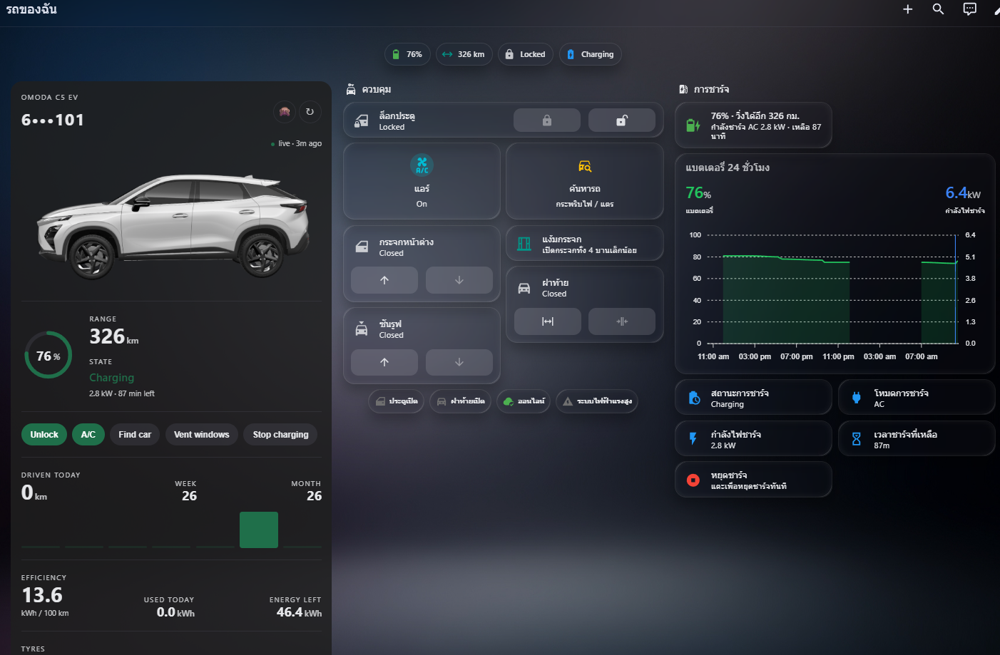
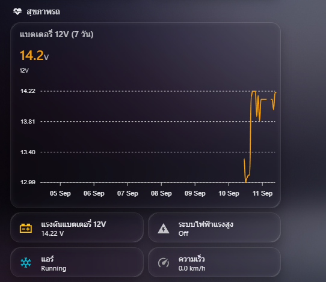

# CarLinko for Home Assistant — unofficial integration

[](https://github.com/thititongumpun/ha-carlinko/releases)
[](https://hacs.xyz)


Bring your **Omoda**, **Jaecoo** or **Chery** car into Home Assistant — battery, charging, tyres,
door lock, A/C and remote controls — if it is one of the cars managed by the **CarLinko** app.

Sign in with your CarLinko account and the integration polls the same cloud API the phone app uses,
exposing the car as normal Home Assistant entities plus a ready-made Lovelace card.

> **Unofficial and unaffiliated.** This project is not made, endorsed or supported by CarLinko,
> Chery, Omoda or Jaecoo. It talks to a reverse-engineered private API; an app update can break it
> at any time. Use at your own risk.

<p align="center">
  
  
  
  
</p>

## Will it work with my car?

If your car is managed through the **CarLinko** app, it is worth trying. The integration talks to
the app's account API, not to any one model, so the cars it supports are whatever CarLinko supports —
sold as Omoda, Jaecoo or Chery across Thailand, Malaysia, Indonesia, Vietnam, UAE, Uzbekistan,
South Africa and elsewhere.

| Car | Status |
|---|---|
| **Omoda C5 EV** (Thailand) | Developed and tested against daily. Everything in this README is confirmed here. |
| **Jaecoo J5** | Lock/unlock, windows, tailgate and stop-charging confirmed by an upstream contributor. |
| Chery, Omoda and Jaecoo models on CarLinko generally | Expected to work. Untested — reports welcome. |

Only the C5 EV is verified by the author. On another model expect the core telemetry to work and
some decoded fields to be wrong or missing: the 73-byte telemetry blob is reverse-engineered and
roughly a third of it is still unidentified, so model-specific fields (A/C temperature, tyre
pressure on cars with indirect TPMS) may read nonsense or stay unknown.

**If you try it on another car**, please
[open an issue](https://github.com/thititongumpun/ha-carlinko/issues) saying which model and what
did or did not work — including "it just worked". That is the only way this list grows. If something
decodes wrong, [Decoding unknown telemetry bytes](#decoding-unknown-telemetry-bytes) has the capture
tooling to pin it down.

## Features

- **Telemetry** every 60 s: battery %, range, odometer, speed, 12 V battery, consumption, WLTC range
- **Charging**: status, AC/DC mode, power, time remaining, plugged-in and charging flags
- **Tyres**: pressure and temperature for all four corners, decoded from the telemetry blob
- **Body**: door lock state, doors (all four, individually), tailgate, windows, sunroof, A/C, high-voltage (car on) state, cloud online
- **Controls**: lock / unlock, A/C on / off, defog, quick cool, seat ventilation, windows open / close / vent, tailgate, sunroof, find car, stop charging
- **Only the entities your car has.** `/user/vehicle` publishes a per-model capability list, and
  every optional entity is gated on it — no sunroof cover on a car without a sunroof, no seat vent
  select on a car without ventilated seats
- **Location**: GPS device tracker every 15 min, with a street address (OpenStreetMap fallback when
  CarLinko has none). Works even if your CarLinko app build has no map screen — the coordinates come
  from the account API, not the app's UI
- **Vehicle image**: the CDN render of your exact car, as an `image` entity
- **Service reminder**: last service odometer / date + intervals on the device page → km and days until service, overdue state
- **Lovelace card** `custom:carlinko-card` (car image, battery ring, range, state, quick actions, driven today / week / month, efficiency, tyre grid), plus a full Thai dashboard example
- **English and Thai** translations for the setup flow, every entity, and enum states
- Token persisted across restarts (CarLinko allows one session per account), automatic re-login, re-auth flow
- No extra Python dependencies

## Installation

### HACS (recommended)
1. HACS → Integrations → ⋮ → **Custom repositories** → add `https://github.com/thititongumpun/ha-carlinko` as *Integration*
2. Install **CarLinko**, restart Home Assistant

### Manual
Copy `custom_components/carlinko` into `config/custom_components/` and restart.

## Configuration

Settings → Devices & services → **Add integration** → *CarLinko*:

| Field | Value |
|---|---|
| Account | e-mail or phone registered in the CarLinko app |
| Password | your CarLinko password |
| Region | `sea` for Thailand / Malaysia / Indonesia (default); `ap`, `emea`, `me`, `naf`, `saf`, `sam`, `uzb`, `vn` |

Each vehicle on the account becomes a device named after its licence plate.

### Use a second account, not your own

CarLinko allows **one session per account**. If Home Assistant logs in as you, your phone gets
signed out — and when you sign back in on the phone, Home Assistant is the one kicked out. The two
keep evicting each other.

Give Home Assistant an account of its own instead:

1. Make a second e-mail address (a free one, or a `+ha` alias if your provider supports it).
2. Register it in the CarLinko app as a new account.
3. From your **main** account, share the car to that address — the app's vehicle sharing /
   authorised-user feature.
4. Accept the invitation on the second account, then use *those* credentials in the integration.

Your phone stays signed in on your own account, Home Assistant holds its own session, and neither
disturbs the other. Revoking access later is one tap in the app and does not touch your own login.

The shared account sees the same telemetry and controls, so nothing in this README changes. If your
app version has no sharing feature, the integration still works with your main account — just expect
to be signed out of the phone app whenever Home Assistant re-authenticates.

## Lovelace card

Add the resource once: Settings → Dashboards → ⋮ → Resources → `/carlinko/carlinko-card.js?v=0.0.11`, type **JavaScript module**. Then:

```yaml
type: custom:carlinko-card
battery_kwh: 61      # usable pack size, for "energy left"
mask_plate: true     # show the plate as B •••• PGB
```

Options, a sections-view example and a full Thai dashboard (Mushroom + ApexCharts) are in
[docs/card.md](docs/card.md) and [docs/dashboard-th.yaml](docs/dashboard-th.yaml).

## Entities

| Platform | Entities |
|---|---|
| Sensor | battery, range, odometer, speed, 12 V battery voltage, energy consumption, rated range (WLTC), charging power, charging time remaining, charging status, charging mode, charge target (estimated), A/C target temperature, distance until service, days until service, next service, tyre pressure ×4, tyre temperature ×4 |
| Binary sensor | charging, cable connected, door open (any), driver / passenger / rear-left / rear-right door, tailgate open, air conditioning, high-voltage system (car on), online |
| Lock | door lock |
| Switch | air conditioning, defog |
| Select | seat ventilation, per seat (off / level 1-3) |
| Cover | windows, tailgate, sunroof (open / close / tilt) |
| Button | find car, vent windows, quick cool, stop charging |
| Device tracker | location (+ `address` attribute) |
| Image | vehicle image |
| Number (config) | last service odometer, service interval km, service interval days, charge estimate calibration |
| Date (config) | last service date |

## Charge target

The car does not report the SoC limit you set on its charging screen, and there is
no command to change it. **Charge target (estimated)** infers it while charging:
the car's own remaining-time estimate already accounts for the limit, so the
target is the current charge plus the energy still to be delivered.

**Charge estimate calibration** is a fitted constant in kWh, *not* your pack's
rated capacity — adjust it until the estimate matches a target you know you set.
It reads low because it absorbs charging losses and the top-end taper: an Omoda
C5 EV with a 61 kWh LFP pack fits at ~55 kWh (the default), and entering 61
makes a true 100 % read 98. LFP packs need a lower value than their rating
because the flat voltage curve gives them a long balancing phase at the top.
The reading is
deliberately not clamped to 100 %: a target that settles above or below your real
limit is the signal to adjust the capacity. Above roughly 90 % the car tapers and
pads its estimate, so a true 100 % shows as 95-105 %. The sensor is unavailable
whenever the car is not charging.

## Service reminder

Dealers rarely log visits into CarLinko, so the integration tracks them itself. On the car's device page
set **Last service odometer** and **Last service date** after each visit. Intervals default to
20,000 km / 365 days and are editable per car. The sensors update immediately, no reload.

Example automation, a month ahead and again when overdue (replace `CAR` with your entity prefix):

```yaml
alias: Car service reminder
triggers:
  - trigger: numeric_state
    entity_id: sensor.CAR_distance_until_service
    below: 1000
  - trigger: numeric_state
    entity_id: sensor.CAR_days_until_service
    below: 30
  - trigger: state
    entity_id: sensor.CAR_next_service
    to: overdue
actions:
  - action: notify.mobile_app_YOUR_PHONE
    data:
      title: Car service due
      message: "{{ states('sensor.CAR_distance_until_service') }} km / {{ states('sensor.CAR_days_until_service') }} days left"
```

## Tyres

Pressure and temperature for all four corners come out of the same telemetry blob as everything
else — no extra request. Both scalings were confirmed against the CarLinko app on an Omoda C5 EV:

| Field | Bytes | Scaling |
|---|---|---|
| Pressure | 44–47 | `kPa = raw × 1.375` |
| Temperature | 48–51 | `°C = raw × 0.5 − 25` |

Order is front-left, front-right, rear-left, rear-right. `0x00` and `0xFF` mean "no reading" and
surface as unknown rather than a bogus zero.

Pressure is stored in kPa. To read it in psi, set the unit per entity in Settings → Devices &
services → Entities → ⚙. The card and the dashboard example both follow whatever unit you pick —
they rate each tyre against the average of the corners that are reporting (amber below 95%, red
below 90%) rather than against a fixed target, so there is nothing to configure per car.

Resolution is one raw count, i.e. 1.375 kPa ≈ 0.2 psi.

## Caveats

- **One session per account.** Logging in from Home Assistant can sign the phone app out and vice versa. The token is stored, so restarts don't re-login. Best avoided entirely by giving Home Assistant [its own shared account](#use-a-second-account-not-your-own).
- **Static-decode commands.** A/C on/off, defog, quick cool, seat vent, find car and sunroof opcodes come from the app's decompiled code and are not yet confirmed on every car. Lock/unlock, windows open/close/vent, tailgate and stop-charging are runtime-confirmed (Omoda C5 EV, Jaecoo J5).
- **A/C target temperature** is model-specific; on the C5 EV it reads an implausible value. This is an upstream CarLinko bug — the app shows the same number — so it is passed through unchanged and is best left off dashboards.
- **Tyre pressure** depends on the car having direct TPMS. Confirmed working on the C5 EV; cars with indirect TPMS report no data and the entities stay unknown.
- **Seat ventilation and quick cool** are gated on the car's own capability list but the blob byte
  offsets behind the seat levels come from another project's capture and are not yet confirmed on an
  Omoda C5. The command side should work; the reported level may be wrong. Reports welcome.
- **No heating entities.** Seat heaters, windshield and steering-wheel heat and quick-heat are
  decoded but not exposed — this is a Thailand-first integration. The opcodes are kept in `const.py`;
  [open an issue](https://github.com/thititongumpun/ha-carlinko/issues) if you are somewhere cold.
- The API is forced to IPv4 because it misbehaves over IPv6 on some ISPs.
- **Only the Omoda C5 EV (Thailand) is verified.** Other CarLinko cars are expected to work; see [Will it work with my car?](#will-it-work-with-my-car).
- Unofficial, reverse-engineered API, not affiliated with CarLinko, Chery, Omoda or Jaecoo. Use at your own risk; a CarLinko app update can break it.

## Command-line testing

```bash
export CARLINKO_ACCOUNT=you@example.com CARLINKO_PASSWORD=secret CARLINKO_REGION=sea
python3 tools/cli.py status      # login, list vehicles, decoded telemetry + raw hex
python3 tools/cli.py locate      # GPS position
python3 tools/cli.py send 740100 # raw opcode (740100 = lock)
python3 tools/cli.py maintain    # dealer service records, if any
python3 -m pytest tests -q       # offline unit tests (signing, telemetry decoding)
```

### Decoding unknown telemetry bytes

Roughly a third of the 73-byte blob is still unidentified. To chip away at it, capture blobs
while the car actually does something — drive, charge, run the A/C, open a window:

```bash
python3 tools/cli.py log --every 60 --out blobs.tsv   # one login, appends only when bytes change
python3 tools/blobdiff.py blobs.tsv                   # which undecoded bytes moved, and to what
```

`log` holds a single session on purpose: CarLinko allows one session per account, so a cron job
that re-logs-in every run would keep signing the phone app out. Ctrl-C to stop.

A byte that tracks something you did is worth decoding; one that never moves across a varied
capture is not telemetry.

## Development

```bash
pnpm install && pnpm build   # rebuilds custom_components/carlinko/www/carlinko-card.js from src/
node --test src/logic.test.ts
```

## Credits

API reverse engineering by [GodrezJr2/j5-ev-dashboard](https://github.com/GodrezJr2/j5-ev-dashboard) and
[elad-bar/ha-carlinko](https://github.com/elad-bar/ha-carlinko). Vehicle renders are served from CarLinko's own CDN.
